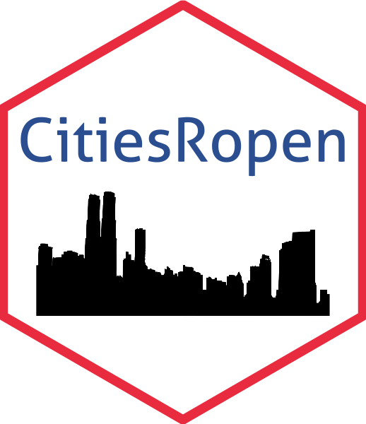

<!-- README.md is generated from README.Rmd. Please edit that file -->

```{r, include = FALSE}
knitr::opts_chunk$set(
  collapse = TRUE,
  comment = "#>",
  fig.path = "man/figures/README-",
  out.width = "100%"
)
```

# CitiesRopen 

<!-- badges: start -->
[](http://www.repostatus.org/#active) 
[](https://www.tidyverse.org/lifecycle/#experimental)
[](https://CRAN.R-project.org/package=CitiesRopen)
<!-- badges: end -->

The goal of CitiesRopen is to provide an easy access to the Open Data Portal [Offene Daten Konstanz](https://offenedaten-konstanz.de/).

# CitiesRopen

This packages provides an easy and accessible tool to directly inspect and download data from the Open Data Portal of Constance. It relies of the [DKAN API](https://www.offenedaten-koeln.de/blog/dkan-api-howto), which allows a direct and current access to all data sets in the portal. 

## Getting Started

You can install the package directly from Github using the `install_github` function from the `devtools` package as shown below. Please make sure, that you have the `devtools` package locally installed on your machine before starting the download. 

```{r, eval=FALSE}
install.packages("devtools")
devtools::install_github("PhilippMartinBosch/CitiesRopen")
```

## How to use the package

### Basic Structure

The package provides to major functions, which build on each other. In order to use the package, you always have to call `show_data` first to get an overview over the files in the data portal. As described below, you can combine your query with different filter arguments to restrict your search to only files of interest. 
Once you have restricted your query, you can start downloading the files using the `get_data` function. In order to connect both functions, you have to use the pipe operator `%>%` from `margritter`.

```{r, eval=FALSE}
#Basic Structure (without filter arguments)
show_data() %>% 
  get_data()
```

### Functions

#### show_data()

The `show_data` function calls the API and retrieves a complete list of data files in the data portal. 
Internally, it calls the API and creates a list of all data sets available in the portal. Depending on the argument specified by the user, this list is then filtered accordingly. 

In terms of terminology, a single **file** represents one specific document with a unique name and format. Several files are then assigned to a smaller number of **ressources**. For instance, the ressource *Wahlergebnisse Konstanzer Oberbürgermeisterwahlen* contains several files, such as the election results for the cities mayor ranging from [1996](https://offenedaten-konstanz.de/dataset/wahlergebnisse-konstanzer-oberb-rgermeisterwahlen/resource/5312abbc-d3ec-4356-920b#{}), [2004](https://offenedaten-konstanz.de/dataset/wahlergebnisse-konstanzer-oberb-rgermeisterwahlen/resource/f1a40479-acab-4826-b2e5#{}), [2012](https://offenedaten-konstanz.de/dataset/wahlergebnisse-konstanzer-oberb-rgermeisterwahlen/resource/a832ba5a-01fd-4bbb-a1e2#{}) to [2020](https://offenedaten-konstanz.de/dataset/wahlergebnisse-konstanzer-oberb-rgermeisterwahlen/resource/af851d57-5f17-4c88-88ba#{}). In a last step, at least one **category** is then assigned to each resource. Categories represent a specific thematic focus, such as *Politik und Wahlen*, *Soziales* and *Umwelt und Klima*. Frequently, more then one tag is assigned to a resource.

In the [data portal](https://offenedaten-konstanz.de/), files are referred to as *Dateien und Quellen*,  resources as *Data Sets* and categories as *Kategorien*.


The following arguments are available for `show_data()`: 

* `file`: Choose a single file by its name. Several files can be selected using the `c()` operator

* `ressource`: Filter for a single resource. One ressource can contain several files. Several     resources can be selected using the `c()` operator

* `category` Filter for a thematic category. 

  Choose from: "Transport und Verkehr", "Umwelt und Klima", "Bevölkerung", "Verwaltung, Haushalt     und   Steuern", "Infrastruktur, Bauen und Wohnen", "Kultur, Freizeit, Sport und Tourismus",     "Bildung     und Wissenschaft", "Geo", "Politik und Wahlen" or"Gesetze und Justiz"

* `format`: Filter for a specific format. 

  Choose from: "csv", "json", "ESRI Hub", "xml", "zip", "shp", "xls", "APP", "KN GIS Hub", "ESRI     Shp", "geojson" or "pdf". 
  
  Note, that not all file formats can be read into R, but only be downloaded locally (see: get_data()).

* `external`: Filter for external data sets.

* `message`: Boolean whether the function should call an overview message.

#### get_data()

* `download`: Specify, where the files should be downloaded. From default, the files are loaded into the working environment. If you want to download the files directly to your local machine, please specify `download = "Local"`.

### Use Cases

Use Case 1: Filtering with filter for `category` and `format`
```{r, eval=FALSE}
CitiesRopen::show_data(category = "Politik und Wahlen", format = "csv") %>% 
  CitiesRopen::get_data()
```

Use Case 2: Filtering with filter for `file`

```{r, eval=FALSE}
CitiesRopen::show_data(file = "Wanderung nach Staaten") %>% 
  CitiesRopen::get_data()
```

Use Case 3: Calling the function without a message

```{r, eval=FALSE}
CitiesRopen::show_data(message = F) %>% 
  CitiesRopen::get_data()
```

Use Case 4: Downloading the files in a local directory

```{r, eval=FALSE}
CitiesRopen::show_data(category = "Geo", format = "csv") %>% 
  CitiesRopen::get_data(download = "Local")
```
...
