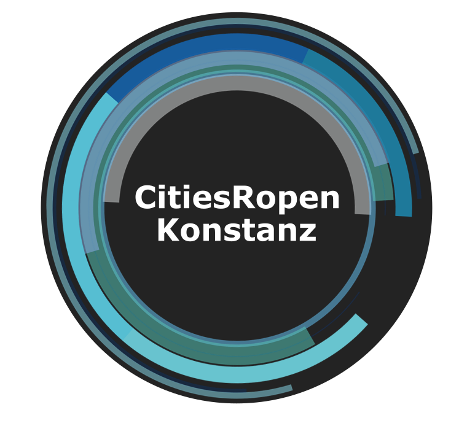

<!-- README.md is generated from README.Rmd. Please edit that file -->

```{r, include = FALSE}
knitr::opts_chunk$set(
  collapse = TRUE,
  comment = "#>",
  fig.path = "man/figures/README-",
  out.width = "100%"
)
```

# CitiesRopen 

<!-- badges: start -->
[](http://www.repostatus.org/#active) 
[](https://www.tidyverse.org/lifecycle/#experimental)
[](https://CRAN.R-project.org/package=CitiesRopen)
<!-- badges: end -->

The goal of CitiesRopen is to provide an easy access to the Open Data Portal of the City of Konstanz [https://offenedaten-konstanz.de/]

## Status

The package is under continuous development and will be extended with additional features in the future.

## Installation

You can install the current version of CitiesRopen from [Github](https://github.com/PhilippMartinBosch/CitiesRopen) with:

``` r
devtools: install_github(“PhilippMartinBosch/CitiesRopen”)
```

## Example

The package contains two major functions. You can use the Pipe-Operator ' %>% ' from margritter to combine them.


```{r cars, eval=FALSE}
show_data() %>% 
  get_data()
```

...
