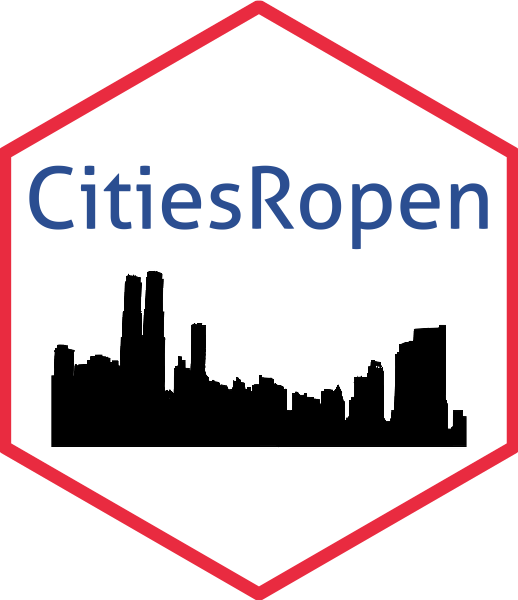

CitiesRopen
================

<!-- README.md is generated from README.Rmd. Please edit that file -->



<!-- badges: start -->

[](http://www.repostatus.org/#active)
[](https://www.tidyverse.org/lifecycle/#experimental)
[](https://CRAN.R-project.org/package=CitiesRopen)
<!-- badges: end -->

This packages allows you to directly inspect and download data from the
[Open Data Portal](https://offenedaten-konstanz.de/) of Constance. It
can be easily used by practioniers, members of the civil society and
academics and expects users to have only a basic understanding of R.
Technically, the package relies on the [DKAN
API](https://www.offenedaten-koeln.de/blog/dkan-api-howto).

## Features

  - Browse all data files in the Open Data Portal of Constance with
    `show_data()`
  - Directly download selected files into R or your local machine with
    `get_data()`
  - Write queries and filter according to specific formats, categories
    or data sources
  - Interactive console interface for maximum user experience
  - Avoid manual downloads and version inconsistencies

## Usage

### Installation

You can install the package directly from Github using the
`install_github` function from the `devtools` package as shown below.
Please make sure, that you have the `devtools` package locally installed
on your machine before starting the download.

``` r
install.packages("devtools")
devtools::install_github("CorrelAid/CitiesRopen")
```

### Structure

The package provides to major functions, which functionally build on
each other. First, you always have to call `show_data` to get an
overview over the files in the data portal. As described below, you can
combine your query with different filter arguments to restrict your
search to only files of interest. Once you have restricted your query,
you can start downloading the files using the `get_data` function. In
order to connect both functions, you have to use the pipe operator `%>%`
from `margritter`.

``` r
#Basic Structure (without filter arguments)
show_data() %>% 
  get_data()
```

#### show\_data()

The `show_data` function calls the API and retrieves a complete list of
data files in the data portal. Internally, it calls the API and creates
a list of all data sets available in the portal. Depending on the
argument specified by the user, this list is then filtered accordingly.

In terms of terminology, a single **file** represents one specific
document with a unique name and format. Several files are then assigned
to a smaller number of **ressources**. For instance, the ressource
*Wahlergebnisse Konstanzer Oberbürgermeisterwahlen* contains several
files, such as the election results for the cities mayor ranging from
[1996](https://offenedaten-konstanz.de/dataset/wahlergebnisse-konstanzer-oberb-rgermeisterwahlen/resource/5312abbc-d3ec-4356-920b#%7B%7D),
[2004](https://offenedaten-konstanz.de/dataset/wahlergebnisse-konstanzer-oberb-rgermeisterwahlen/resource/f1a40479-acab-4826-b2e5#%7B%7D),
[2012](https://offenedaten-konstanz.de/dataset/wahlergebnisse-konstanzer-oberb-rgermeisterwahlen/resource/a832ba5a-01fd-4bbb-a1e2#%7B%7D)
to
[2020](https://offenedaten-konstanz.de/dataset/wahlergebnisse-konstanzer-oberb-rgermeisterwahlen/resource/af851d57-5f17-4c88-88ba#%7B%7D).
In a last step, at least one **category** is then assigned to each
resource. Categories represent a specific thematic focus, such as
*Politik und Wahlen*, *Soziales* and *Umwelt und Klima*. Frequently,
more then one tag is assigned to a resource.

In the [data portal](https://offenedaten-konstanz.de/), files are
referred to as *Dateien und Quellen*, resources as *Data Sets* and
categories as *Kategorien*.

The following arguments are available for `show_data()`:

  - `file`: Choose a single file by its name. Several files can be
    selected using the `c()` operator

  - `ressource`: Filter for a single resource. One ressource can contain
    several files. Several resources can be selected using the `c()`
    operator

  - `category` Filter for a thematic category. Several categories can be
    selected using the `c()` operator
    
    Choose from: “Transport und Verkehr”, “Umwelt und Klima”,
    “Bevölkerung”, “Verwaltung, Haushalt und Steuern”,
    “Infrastruktur, Bauen und Wohnen”, “Kultur, Freizeit, Sport und
    Tourismus”, “Bildung und Wissenschaft”, “Geo”, “Politik und Wahlen”
    or “Gesetze und Justiz”

  - `format`: Filter for a specific format.
    
    Choose from: “csv”, “json”, “ESRI Hub”, “xml”, “zip”, “shp”, “xls”,
    “APP”, “KN GIS Hub”, “ESRI Shp”, “geojson” or “pdf”.
    
    Note, that not all file formats can be read into R, but only be
    downloaded locally (see: get\_data()).

  - `external`: Filter for external data sets.

  - `message`: Boolean whether the function should call an overview
    message.

#### get\_data()

  - `download`: Specify, where the files should be downloaded.

Choose from: “environment” (default) or "local

If you want to read the data directly in R, you can use the default
setting for “environment”, which saves the data in a new list
`List_Open_Data`, where each element of the list represents one data
file. If you want to download the files directly to your local machine,
please specify `download = "local"`.

### Use Cases

Use Case 1: Filtering with filter for `category` and `format`

``` r
CitiesRopen::show_data(category = "Politik und Wahlen", format = "csv") %>% 
  CitiesRopen::get_data()
```

Use Case 2: Filtering with filter for `file`

``` r
CitiesRopen::show_data(file = "Wanderung nach Staaten") %>% 
  CitiesRopen::get_data()
```

Use Case 3: Calling the function without a message

``` r
CitiesRopen::show_data(message = F) %>% 
  CitiesRopen::get_data()
```

Use Case 4: Downloading the files in a local directory

``` r
CitiesRopen::show_data(category = "Geo", format = "csv") %>% 
  CitiesRopen::get_data(download = "Local")
```

…
